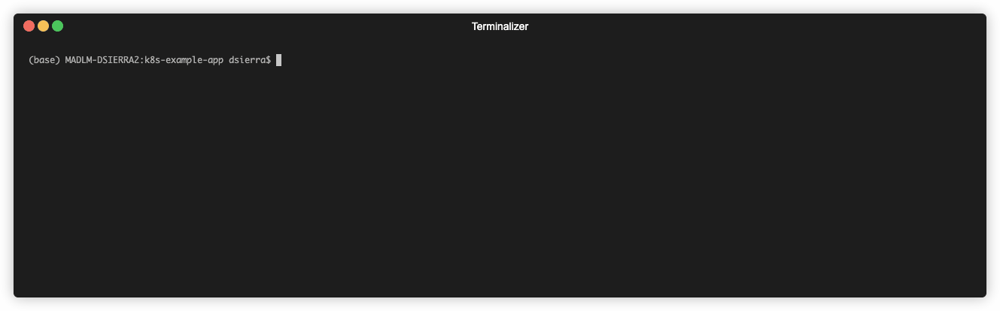
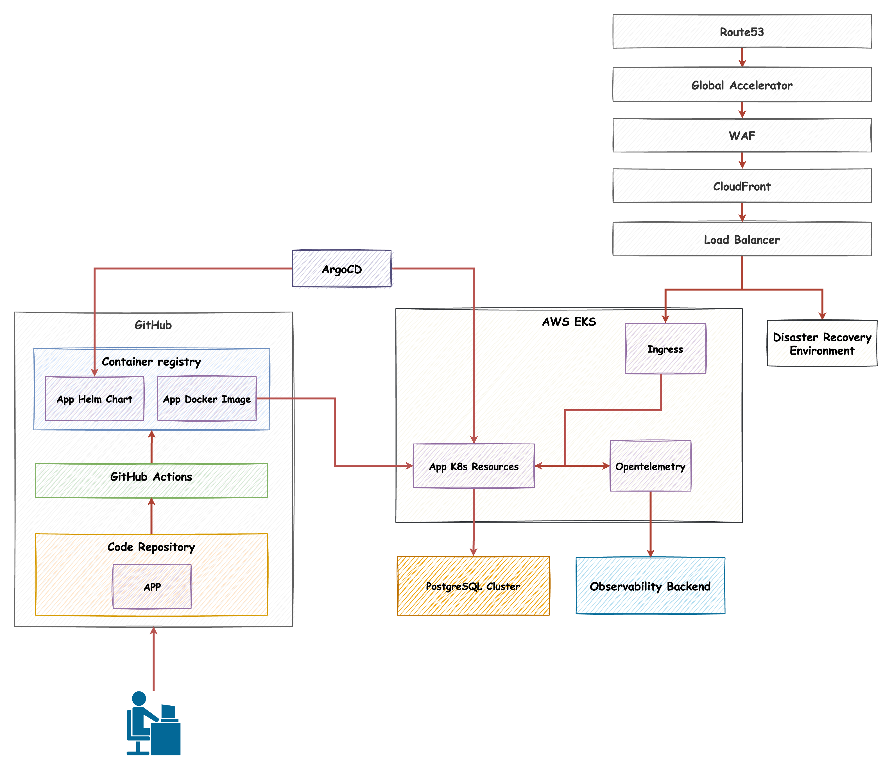

# Kubernetes Example App


## Development Environment

This project provides two main ways to run the application:

### Local Development Environment

To start the local development environment, run:
```bash
make start-dev-env
```
This command starts a local environment that allows you to develop the project using Docker Compose.



### Cloud Environment Simulation

To simulate a cloud environment with Kubernetes, run:
```bash
make start-cloud-env
```
This command sets up a local Kubernetes cluster using Kind, deploys PostgreSQL, and runs the application in a cloud-like environment.


## Documentation

Detailed information about best practices and project guidelines can be found in the `docs` directory:

- [Kubernetes Deployments](docs/kubernetes-deployments.md)
- [Observability](docs/observability.md)
- [Kubernetes Tools](docs/kubernetes-tools.md)
- [Database Management](docs/database-management.md)
- [Secrets Management](docs/secrets.md)
- [Architecture Diagram](docs/architecture-diagram.md)
- [Infrastructure as Code](docs/infrastructure-as-code.md)

The cloud solution architecture diagram can be found in [docs/architecture-diagram.md](docs/assets/architecture-diagram.md).

## Cloud Architecture Solution

The following diagram illustrates a possible cloud architecture solution:



## ⚠️ AI Development

Some parts of this project has been developed with AI tools. All code and documentation have been carefully reviewed and tested to ensure quality and reliability.